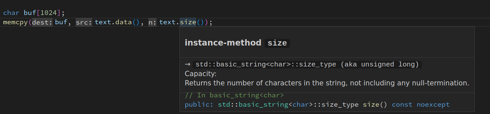

# clangd

[clangd](https://clangd.llvm.org) helps developers write, understand and
improve C/C++ code by providing:

 - code completion
 - compile errors and warnings
 - go-to-definition and cross references
 - hover information and inlay hints
 - include management
 - code formatting
 - simple refactorings

Full documentation for clangd is at [clangd.llvm.org](https://clangd.llvm.org).

## Setup

### `clangd` server

The extension requires the `clangd` language server.
You will be prompted to download it if it's not found on your PATH.
(Automatic installation is possible on x86-64 Linux, Windows, and Mac).

If you have an old version of clangd installed on your system already, you can
run "Check for clangd language server update" from the command palette.

### Project setup

clangd is based on the clang C++ compiler, and understands even complex C++
code.  However, you must tell clangd how your project is built (compile flags).
[A `compile_commands.json` file](http://clang.llvm.org/docs/JSONCompilationDatabase.html)
can usually be generated by your build system
(e.g. with CMake, by setting `-DCMAKE_EXPORT_COMPILE_COMMANDS=1`).

See [Project Setup](https://clangd.llvm.org/installation#project-setup)
in the clangd documentation for details and alternatives.

The clangd server also supports a number of feature customizations using its
[config file](https://clangd.llvm.org/config.html).

## Features

### Code completion

Suggestions will appear as you type names, or after `.` or `->`.
Because clangd uses a full C++ parser, code completion has access to precise
type information.

### Errors, warnings, and clang-tidy

Code errors are shown as you type (both as red squiggle underlines, and in the
"Problems" panel). These are the same as produced by the clang compiler, and
suggested fixes can automatically be applied.

Most clang-tidy checks are supported (these can be enabled using a [.clang-tidy
file](https://clang.llvm.org/extra/clang-tidy/)).

### Cross-references

Go-to-definition and find-references work across your code, using a project-wide
index.

Press `Ctrl-P #` to quickly navigate to a symbol by name.

### Hover and inlay hints

Clangd can describe almost any entity if you hover the mouse (or press Ctrl-KI).

Inlay hints for parameters and deduced types can be shown temporarily or
permanently (the `editor.inlayHints.enabled` setting controls this).

### Include management

Code completion works across your codebase and adds `#include` directives where
needed. The `•` shows includes that will be inserted.

clangd can suggest inserting missing #includes, where they cause errors.
It can [warn on unused includes](https://clangd.llvm.org/guides/include-cleaner).

### Formatting

clangd uses the `clang-format` engine. You can format a file or the selection.
When "Format on Type" is enabled in the settings, pressing enter will cause
clangd to format the old line and semantically reindent.

The style used for formatting (and certain other operations) is controlled by the project's
[.clang-format file](https://clang.llvm.org/docs/ClangFormatStyleOptions.html).

Note that if you prefer to use something other than clangd for formatting, you can
choose a different formatter with the `"editor.defaultFormatter"` setting.

### Refactoring

clangd supports some local refactorings. When you select an expression or
declaration, the lightbulb menu appears and you can choose a code action.

Current refactorings include:
 - extract variable/function
 - expand `auto` types and macros
 - use raw strings
 - rename (bound to `<F2>`, rather than a contextual code action)

## Bugs/contributing

clangd is part of the [LLVM project](https://llvm.org).

If you'd like to help out, reach out to clangd-dev@lists.llvm.org.

If you've found a bug in this extension, please file it at https://github.com/clangd/vscode-clangd/issues.
If you've found a bug in clangd, please file at https://github.com/clangd/clangd/issues.
