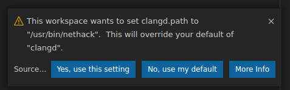

# Settings

## Multi-Root Workspaces

### `clangd.enablePerFolderServer`

Controls whether to run a separate clangd instance for each workspace folder.

- **Default**: `false`
- **Scope**: `window` (workspace-level setting)

When `false` (default), a single global clangd instance handles all workspace
folders. This is simpler and uses less memory.

When `true`, each workspace folder gets its own dedicated clangd instance. This
allows each folder to use different clangd executables, arguments, and
configurations. Useful when working with projects that have different toolchains
or when you want crash/memory isolation between projects.

```json
{
  "clangd.enablePerFolderServer": true
}
```

**Note**: This is a workspace-level setting (not per-folder). Either all folders
share a single clangd instance, or each folder gets its own instance.

## Security

This extension allows configuring command-line flags to the `clangd` executable.

Being able to configure these per-workspace can be convenient, but runs the risk
of an attacker changing your flags if you happen to open their repository.
Similarly, allowing the workspace to control the `clangd.path` setting is risky.

When these flags are configured in the workspace, the extension will prompt you
whether to use them or not. If you're unsure, click "No".



If you choose "Yes" or "No", the answer will be remembered for this workspace.
(If the value changes, you will be prompted again).
