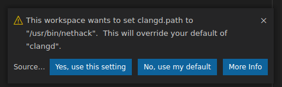

# Settings

## Security

This extension allows configuring command-line flags to the `clangd` executable.

You can set `clangd.path` globally, or use platform-specific overrides:
`clangd.path.linux`, `clangd.path.osx`, and `clangd.path.windows`.
Don't specify `clangd.path` if you want to use the platform specific settings as Visual Studio Code will discard these in this case.

Being able to configure these per-workspace can be convenient, but runs the risk
of an attacker changing your flags if you happen to open their repository.
Similarly, allowing the workspace to control the `clangd.path` settings is risky.

When these flags are configured in the workspace, the extension will prompt you
whether to use them or not. If you're unsure, click "No".

If you choose "Yes" or "No", the answer will be remembered for this workspace.
(If the value changes, you will be prompted again).
